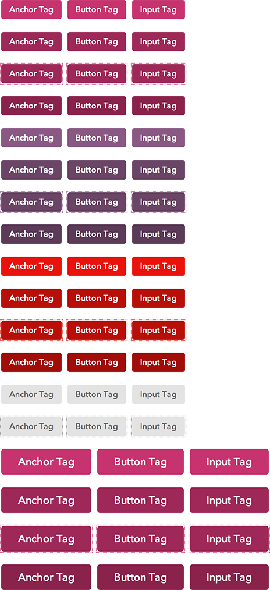

# cf-buttons

Button styles including default, secondary, destructive, disabled, super, and
compound buttons, button links, buttons with icons, and button groups.
This component can be used by itself, but it was made for Capital Framework,
a new front end framework developed at the
[Consumer Financial Protection Bureau](https://cfpb.github.io/).

If you would like to take advantage of more components or if you're new to
Capital Framework, we encourage you to [start here](https://cfpb.github.io/capital-framework/).

- [View the docs](https://cfpb.github.io/cf-buttons/docs/)
- [See the raw demo](https://cfpb.github.io/cf-buttons/demo/)

The current version number can be found in <bower.json>.
We follow [semver](http://semver.org/).

## How to get this running or how to use it

Detailed instructions can be found in the Capital Framework
[documentation site](https://cfpb.github.io/capital-framework/components/)

## Getting involved

We welcome your feedback and contributions.

- [Find out about contributing](CONTRIBUTING.md)
- File a bug using this [handy template](https://github.com/cfpb/cf-buttons/issues/new?body=%23%23%20URL%0D%0D%0D%23%23%20Actual%20Behavior%0D%0D%0D%23%23%20Expected%20Behavior%0D%0D%0D%23%23%20Steps%20to%20Reproduce%0D%0D%0D%23%23%20Screenshot&labels=bug)

----

## Open source licensing info
1. [TERMS](TERMS.md)
2. [LICENSE](LICENSE)
3. [CFPB Source Code Policy](https://github.com/cfpb/source-code-policy/)

----

## Credits and references

Docs and demo built with the excellent [Topdoc](https://github.com/topcoat/topdoc/).
